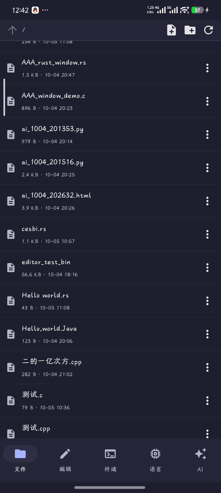
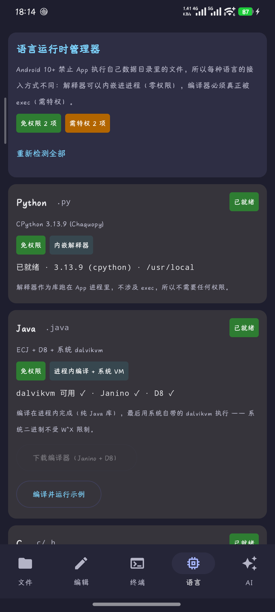
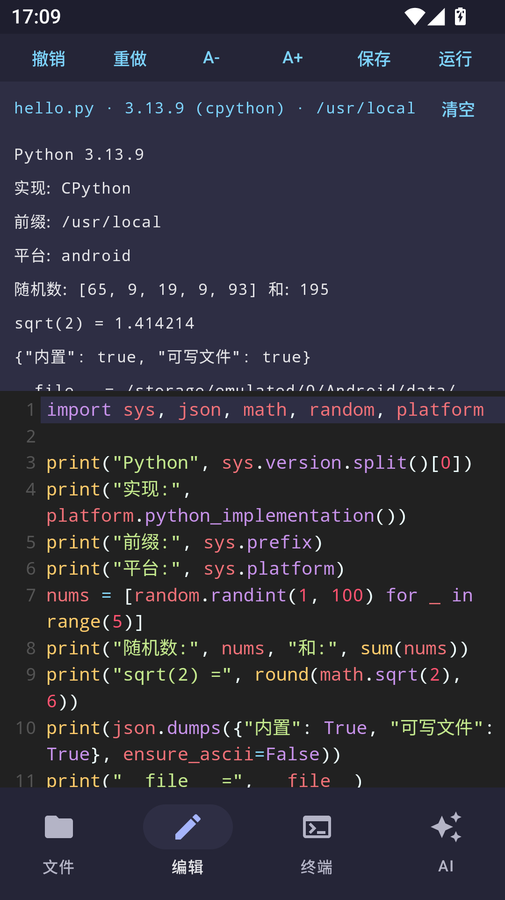

# 掌上代码 CodePocket

**在手机上写代码，并且真的能跑起来。** 文件管理 + 代码编辑器 + 真终端（带包管理器）+ 内置浏览器 + AI 助手，支持 **5 种语言**：Python / Java / C / C++ / Rust —— **全部零 root、零 Shizuku、零 ADB**。




| 语言运行时状态 | Python 运行 | 终端 + 包管理器 |
|:---:|:---:|:---:|
|  |  |  |

> 截图取自开发过程中的真机（Redmi K50 Ultra / Android 17 / HyperOS / SELinux Enforcing）。
> 界面仍在演进，个别细节可能与当前版本略有差异——**未验证的功能下文都有明确标注**。

## 为什么它值得一看

- **5 种语言是真的能跑**，不是语法高亮玩具：Python 用 Chaquopy 把 CPython 3.13.9 嵌进进程；Java 走 Janino → D8 → 系统 `dalvikvm`；C/C++/Rust 用按需下载的 Termux 工具链。
- **零特权**：不需要 root、Shizuku 或 ADB。靠把 `targetSdk` 定为 **28** 换取旧 SELinux 域的执行豁免——**这个取舍有 A/B 实验证据**（同一 APK、同一探针：`targetSdk 34 → error=13 Permission denied`，`targetSdk 28 → 退出码 0`）。
- **能画图**：一套原生窗口 API（**软件渲染，不依赖 GL/EGL**，任何设备都能出画面），C/C++/Rust/Python 都能开窗口。
- **AI 能自己建文件**：用**代码块协议**而不是 OpenAI tool-calling——因为"任意 OpenAI 兼容接口"里很多根本没实现 `tools`，而工具调用失败是**静默**的。
- **终端带包管理器**：装的是真正的 Termux 仓库包（索引解析 + 依赖闭包 + 手写的 ar/xz/tar 解包器），且**不拦截键盘输入**，管道、重定向、`&&` 等 shell 语义全都完好。
- **一个终端、五种架构决策**：每种语言接进 Android 的方式都不一样，下文逐条记录了为什么。

## 5 种语言，全部零特权

| 语言 | 运行机制 | root / Shizuku | 图形界面 | 实测证据 |
|---|---|---|---|---|
| **Python** | Chaquopy 把 CPython 3.13.9 嵌进 App 进程 | ❌ | ✅ 画布（ctypes 调 `cp_*`） | `Python.start ok in 408ms`，脚本 24ms 跑完 |
| **Java** | **Janino** 编译 → **D8** 转 dex → 系统 `dalvikvm` | ❌ | ✅ **真正的 Android 控件** | `JAVA_ON_ANDROID_OK` / `sum(1..10)=55` |
| **C** | Termux clang 按需下载（15 包 82.8 MB），靠 **targetSdk 28 的 exec 豁免** | ❌ | ✅ 画布（`codepocket.h`） | `C_ON_ANDROID_OK` / `Clang 21.1.8` |
| **C++** | 同上 + libc++ | ❌ | ✅ | `CPP_ON_ANDROID_OK` / `std::accumulate` 正常 |
| **Rust** | Termux rustc 懒加载（首次运行 `.rs` 时自动装） | ❌ | ✅ cdylib + `cp_main` | 已实现，**尚未在真机端到端验证** |

编辑器打开文件后，工具栏按钮**按类型出现**（不适用的按钮根本不渲染）：

| 文件类型 | 可用按钮 |
|---|---|
| `.py` | 运行 · 窗口 |
| `.java` | 运行 · **界面**（DexClassLoader 载入 App 进程，用真控件建界面） |
| `.c` / `.cpp` | 运行 · 窗口 |
| `.rs` | 运行 · 窗口 |
| `.html` / `.svg` | 预览（内置浏览器，`file://`） |

> 按钮为什么必须"按类型出现"：Material3 的 `TextButton` 有 `ButtonDefaults.MinWidth = 58dp`
> 的硬性下限，9 个按钮需要约 1550px，而屏幕只有 1220px——最右侧的「窗口」被整个挤出屏幕，
> **窗口功能从界面上完全点不到**。压缩内边距和字号都没用（下限在组件内部）。这个 bug 在真机
> 上定位并修复，代价是三次无效尝试。
>
> 已移除「本地服务」按钮：内置浏览器自带地址栏，输 `http://127.0.0.1:8000` 即可。

**运行前自动保存**，保证跑的就是屏幕上看到的；输出（含编译器警告与异常回溯）显示在编辑器下方。

> **交互式程序请在「终端」里运行**：编辑器只捕获输出、不提供 stdin，所以等输入的程序会在
> 15 秒后被停止并提示。这是设计如此，不是故障。

## 另外三块值得一提的能力

**① 终端里的包管理器**（`pkg list / search / info / install / remove / update`）
实现方式是**文件协议**：终端是真 PTY 里跑的 `sh`，且它与 App **同 uid**，所以 `pkg` 是一个
shell 脚本——写 `pkg.req`，App 常驻线程读走干活，把输出分块写回 `pkg.res`，脚本边等边打印。
**没有拦截键盘输入**，因此管道、重定向、`&&` 等 shell 语义全都完好。装的是真正的 Termux
仓库包（索引解析 + 依赖闭包 + 手写的 ar/xz/tar 解包器）。

**② AI 能自己创建文件**
用**代码块协议**而不是 OpenAI tool-calling——因为"任意 OpenAI 兼容接口"里很多根本没实现
`tools`，而工具调用失败是**静默**的。协议长这样：

````
```file:fib.py
def fib(n): ...
```
````

App 解析后**直接落盘**并回报"已写入 1 个文件"；普通代码块（不带 `file:`）只显示不落盘。
路径按**敌意输入**处理：拒绝 `..`、绝对路径、盘符、点文件，合并后还用 `canonicalPath`
再校验一次。AI 输出还支持**流式**，流式失败会自动回退到整段返回。

**③ 一套原生图形窗口 API**（`cp_open/cp_clear/cp_pixel/cp_line/cp_circle/cp_present`）
软件渲染，不依赖 GL/EGL，任何设备都能出画面。C/C++ 用 `codepocket.h`，Python 用
`import codepocket`，Rust 用 `extern "C"` + `#[no_mangle] pub extern "C" fn cp_main()`。
之所以必须编译成**共享库**而不是可执行文件：Android 没有显示服务，窗口只能由 Activity 的
Surface 提供，而独立进程拿不到 Surface。

一键装卸：`语言` 页签列出每种语言的**真实状态**（现场探测，不是写死的）与占用体积，
`检测执行权限` 按钮会**现场做实验**告诉你这台设备能不能执行数据目录里的二进制。


## 为什么每种语言的接法都不一样（这一节是本项目最核心的知识）

Android 10+ 有一条硬规则：**targetSdk ≥ 29 的 App 不能 exec 自己数据目录里的文件**
（SELinux `untrusted_app` 域对 `app_data_file` 没有 execute 权限）。语言因此分成两类：

- **解释器**可以当库嵌进 App 进程，完全不涉及 `exec` → **零权限**即可（Python）。
- **编译器**天生必须被 `exec`，编译产物也是 → 只能：降 targetSdk 换取豁免 / 用
  Shizuku·root 代执行 / 把二进制塞进 `nativeLibraryDir`。

本项目选了**降 targetSdk 到 28**（Termux 走的就是这条路），并用 A/B 实验确认了因果：

| 同一台手机、同一个 APK、同一个探针二进制 | 结果 |
|---|---|
| `targetSdk = 34` | `IOException: error=13, Permission denied` |
| `targetSdk = 28` | `退出码=0 输出=EXEC_FROM_APPDATA_OK` |

代价：不能上 Google Play（自用无妨），部分行为回到旧版。换来的是 **C/C++ 无需 root、
无需 Shizuku、无需联网授权**。

Java 走了一条更巧的路：**除了最后一步，全部在进程内完成**。`.java → .class`（Janino，纯
Java 库）→ `.class → .dex`（D8，纯 Java 库）→ `dalvikvm`（位于 `/apex/...` 的**系统**二进制，
exec 系统目录不受 W^X 限制，我们的 dex 只是被它当数据读取）。

## 温度/工具链安装流程

1. App 内拉取 Termux 的 `Packages` 索引（约 1.8 MB）
2. 递归解析 `clang` 的依赖树 —— 15 个包、82.8 MB（aarch64），**先报数再下载**
3. 逐个下载 `.deb`，用自写的解析器解包：`ar`（60 字节成员头）→ `data.tar.xz`（xz 流）
   → tar（512 字节头、八进制 mode、GNU 长文件名、符号链接），保留可执行位
4. Termux 前缀 `data/data/com.termux/files/` 被剥离，解到 `files/toolchains/root/usr/`
5. 执行时提供 `LD_LIBRARY_PATH=<root>/usr/lib`（Termux 二进制内嵌的是它自己的 RPATH）

下载 82.8 MB → 解压后占 **804.7 MB**（约 10 倍膨胀，界面会显示实际占用）。

## 构建与安装

```powershell
$env:JAVA_HOME='E:\Android\jdk-21'; $env:ANDROID_HOME='E:\Android'
$env:GRADLE_USER_HOME='D:\gradle-home'
$env:Path="$env:JAVA_HOME\bin;E:\Android\gradle-8.9\bin;E:\Android\platform-tools;"+$env:Path

gradle -Pabis=arm64-v8a --no-parallel assembleDebug   # 真机
gradle -Pabis=x86_64    --no-parallel assembleDebug   # MuMu
gradle testDebugUnitTest                              # 14 个单元测试
adb install -r -t app\build\outputs\apk\debug\app-debug.apk
```

## 踩过的坑（按发现顺序，每条都是实测结论）

1. 终端里的 shell 与 App 同 uid；`/sdcard` 上的二进制是 `noexec`，**产物必须放内部存储**。
2. CodeMirror 保存时会把 CRLF 规范成 LF。
3. **Chaquopy 必须先 `Python.start(AndroidPlatform(context))`**，否则抛
   `Cannot use GenericPlatform on Android`。现在由 `CodePocketApp` 初始化，且失败不致命。
4. `MainActivity` 里的 `Diag.clear()` 会把初始化日志擦掉——证据没了就难查。
5. `buildPython` 与目标 Python 大版本不一致只是警告并跳过字节码预编译，不影响功能。
6. **构建被中断会留下脏状态**：`Current thread does not hold the state lock`。解法是
   `gradle --stop` + 删 `app/build`/`.gradle`/`.cxx` + **`--no-parallel`**。并行构建下
   更容易复现，加 `--no-parallel` 后连续多次均成功。
7. Chaquopy 为每个 ABI 单独下载约 7 MB 运行时，网络慢时会长时间"看起来卡住"
   （实测发生过一次，日志里 9 条连接挂着但磁盘无写入）。所以加了 `-Pabis=` 开关。
8. **Android 用 ICU 正则，比 JVM 的 `java.util.regex` 严格：单独的 `}` 是语法错误。**
   同一个正则 JVM 上单元测试全绿、装机一启动就闪退——因为它写在 `companion object` 里，
   异常发生在 `<clinit>`，直接干掉整个进程。教训：花括号一律转义，且**解析必须兜底**。
9. **ECJ 在 Android 上用不了**：3.46 与 3.18 都引用 JDK 专有的
   `javax.lang.model.SourceVersion` / `javax.annotation.processing.ProcessingEnvironment`，
   Android 没有这些包。改用 **Janino**（为嵌入设计）后一次通过。
   `CompilationProgress` 实际在 `org.eclipse.jdt.core.compiler` 而非 `internal.compiler`，
   反射时写错包名也会以 `ClassNotFoundException` 形式暴露。
10. **D8 能在 Android 进程内跑**（这是当初最大的未知数）：但不能调 `D8.run(String[])`
    （9.x 没这个入口，要用 `main(String[])`），而且**它的 CLI 不认目录输入**
    （报 `ux: Unsupported source file type`），必须逐个传 class 文件。
11. **能力检测必须查真实生效的路径**。犯过两次同类错误：一次查 `files/javalibs/*.jar`
    而依赖其实在 APK 的 dex 里（应查 `Class.forName`），一次查 `toolchains/clang/bin/clang`
    而工具链其实在 `toolchains/root/usr/bin/clang`。**查错路径等于对用户撒谎**。
12. **外部存储 `noexec`**：把编译产物放在 `Android/data/<pkg>/files/workspace/`（源文件旁边）
    导致 `IOException: error=13, Permission denied`。编译能过、运行瞬间失败。
    正确组合：**产物放内部存储，工作目录保持源文件所在目录**（相对路径才正常）。
13. 概念上要区分「**实现需要 exec 能力**」和「**用户需要特权**」——混淆这两者会让界面
    错误地宣称 C/C++ 需要 root。UI 已改为「依赖 exec 豁免」。
14. 用 `adb shell input swipe` 做 UI 自动化时**有惯性**：滑完立刻按固定坐标点击会落空
    （连续三次失败）。应放慢到 900ms 并静置 5 秒，或滑动后先截图再点。
15. 解包器这类纯逻辑，**用单元测试验证远比点界面可靠**——`ToolchainInstallerTest` 一次就
    给出确定结论，而同样的验证靠 UI 点击失败了三次。


## v0.2 新增：内置 Python

**这是 v0.1 缺的那块，也是整个项目最难的一块。**

Android 10+ 禁止 App 执行自己私有目录里的二进制（W^X），所以「解压一个 python 二进制再 exec」
这条路根本走不通。现在的做法是 **Chaquopy 把 CPython 嵌进 App 进程**（进程内跑，不涉及 exec）：

- 编辑器打开 `.py` 后点 **「运行」** → 先保存 → 用内置 CPython 执行 → 输出显示在编辑器下方
  （异常回溯也会被捕获并显示）
- 内置版本：**CPython 3.13.9**，`sys.platform == "android"`，标准库 `sys/json/math/random/platform` 均可用
- 首次 `Python.start` 约 0.6s，之后单个脚本执行约 **24ms**
- APK 从 16.5 MB 增至 **34.4 MB**（多出来的就是每个 ABI 一份的 Python 运行时）

实测输出（MuMu 上真实结果）：

```
Python 3.13.9
实现: CPython
前缀: /usr/local
平台: android
随机数: [65, 9, 19, 9, 93] 和: 195
sqrt(2) = 1.414214
{"内置": true, "可写文件": true}
```

## 功能现状

| 页签 | 状态 | 说明 |
|---|---|---|
| 文件 | ✅ | 工作区浏览、新建文件/文件夹、重命名、删除、点开进编辑器 |
| 编辑 | ✅ | CodeMirror 5 多语言高亮 + **运行 Python（内置 CPython 3.13.9）** |
| 终端 | ✅ | **真 PTY**（`forkpty` + `/system/bin/sh`），xterm.js 渲染，颜色/窗口尺寸/交互都正常 |
| AI | ✅ | 任意 OpenAI 兼容接口，回复里的代码块可一键存成对应扩展名的文件并打开 |

## 架构

```
app/src/main/
├── cpp/pty.c                    forkpty + TIOCSWINSZ + waitpid（JNI 只在 native 做这三件事）
├── assets/web/
│   ├── terminal.html            xterm.js + FitAddon，与 Kotlin 通过 base64 双向通信
│   └── editor.html              CodeMirror 5
└── java/com/dsh/codepocket/
    ├── Diag.kt                  诊断日志落盘（本机 logcat 不可用，靠它调试）
    ├── MainActivity.kt          四页签骨架 + 共享状态
    ├── terminal/                PtyNative / TerminalSession / TerminalScreen
    ├── files/                   FileRepository / FilesScreen
    ├── editor/                  EditorScreen + JS 桥
    ├── ai/                      AiClient（HttpURLConnection + org.json）/ AiScreen
    └── web/AssetWebView.kt      WebViewAssetLoader 提供 https://appassets.androidplatform.net 资源
```

关键设计：**读写 PTY 全在 Kotlin 侧**（`ParcelFileDescriptor.adoptFd` + 文件流），JNI 只负责
创建进程、设置窗口大小、回收子进程。这样 native 代码只有 ~180 行，风险面最小。

## 构建与安装

```powershell
$env:JAVA_HOME='E:\Android\jdk-21'; $env:ANDROID_HOME='E:\Android'
$env:GRADLE_USER_HOME='D:\gradle-home'
$env:Path="$env:JAVA_HOME\bin;E:\Android\gradle-8.9\bin;E:\Android\platform-tools;"+$env:Path

# 默认两个 ABI（arm64-v8a 给真机，x86_64 给 MuMu），Chaquopy 会为每个 ABI 下载一份 Python
gradle assembleDebug

# 只构建一个 ABI 可大幅提速（Chaquopy 每 ABI 要下 ~7 MB 运行时）
gradle -Pabis=x86_64 assembleDebug      # MuMu
gradle -Pabis=arm64-v8a assembleDebug   # 真机

adb install -r -t app\build\outputs\apk\debug\app-debug.apk
```

### Chaquopy 相关配置（app/build.gradle.kts）

```kotlin
chaquopy {
    defaultConfig {
        version = "3.13"                                    // 内置 Python 版本
        buildPython("C:\\Program Files\\Python314\\python.exe")  // 构建期用的本机 Python
    }
}
```

兼容性（Chaquopy 17.0 官方表格）：Python 3.10–3.14 · AGP 7.3–9.2 · minSdk ≥ 24。

## 安装与文件位置

```powershell
adb install -r -t app\build\outputs\apk\debug\app-debug.apk
```

工作区在 App 私有外部目录，不需要任何权限，也能从电脑直接拿：

```
/sdcard/Android/data/com.dsh.codepocket/files/workspace
adb pull /sdcard/Android/data/com.dsh.codepocket/files/workspace
```

诊断日志（排查问题先看它）：

```
adb pull /sdcard/Android/data/com.dsh.codepocket/files/diag.log
```

## 测试 AI 通路（不需要真 Key）

`tools/mock_ai_server.py` 是一个最小的 OpenAI 兼容 mock 服务：

```powershell
python tools\mock_ai_server.py            # 监听 127.0.0.1:8080
adb reverse tcp:8080 tcp:8080             # 手机 localhost:8080 -> 电脑 8080
```

App 设置里填：Base URL `http://127.0.0.1:8080/v1`，模型名任意，Key 任意。
（`res/xml/network_security_config.xml` 只对 127.0.0.1/localhost/10.0.2.2 放开明文 HTTP，
其余域名仍禁止明文。）

## 真机上踩到的坑（都已修，改动理由记在这里）

1. **`vh` 单位在这个 WebView 里解析为 0**。`height:100vh` 和 `height:100%` 都算不出高度，
   终端容器一度只有 3px 高，xterm 因此只算出 `rows=1`。现在所有尺寸都用
   `window.innerHeight/innerWidth` 显式写成像素。
2. **xterm 默认 80 列会撑破手机视口**，WebView 的视觉视口被横向平移，左侧内容永久被裁掉。
   现在初始 `cols/rows` 取保守值，fit 之后再由 `onResize` 通过 `TIOCSWINSZ` 同步给 shell。
3. **中文输入法的拼音组合态进不了 WebView DOM**（`compositionstart/update` 都不触发，
   探针实测）。所以终端的主要输入方式是 Compose 原生输入行，xterm 自带输入框只对
   能直接提交拉丁字符的输入法有效。
4. **这台 ROM 的 logcat 完全不可用**（`adb logcat -d` 输出 0 行）。调试全部依赖 `Diag` 写文件。
5. **执行限制（Android 10+ 的 W^X）**：App 私有目录里的二进制不能 `exec`。
   所以 v0.1 没有内置 Python/C++ 运行时——内置它们必须走 `nativeLibraryDir` 伪装成 `.so`
   或 Chaquopy 进程内嵌，这是 v0.2 的工作。
6. CodeMirror 保存时会把 CRLF 规范成 LF。
7. 终端里的 shell 与 App 同 uid（`u0_a337`）。设备已 root，需要 root 时可在终端里直接敲 `su`。

### v0.2 引入 Chaquopy 后又踩到的坑

8. **必须先 `Python.start(AndroidPlatform(context))`**，否则第一次调用就抛
   `RuntimeException: Cannot use GenericPlatform on Android`。
   现在由 `CodePocketApp`（新增的 Application 子类）在 `onCreate` 里初始化，
   并且**失败也不致命**——编辑器和终端不依赖 Python，照常可用。
9. **`Python.start()` 的日志不能被清掉**：原来 `MainActivity.onCreate` 里调了 `Diag.clear()`，
   会把初始化结果擦掉；现在清日志只在 Application 里做一次。
10. **`buildPython` 的版本要和目标 Python 的大版本对齐**，否则 Chaquopy 只是**警告**并跳过
   字节码预编译（`is not a valid Python 3.13 command: it is version 3.14`），
    功能不受影响，只是首次导入略慢。
11. **构建被中断后会留下脏状态**，再次构建可能报
    `Current thread does not hold the state lock for root project`——这不是代码问题。
    解法：`gradle --stop` + 删掉 `app/build`、`.gradle`、`app/.cxx` + `--no-parallel` 重建。
12. **Chaquopy 为每个 ABI 单独下载 ~7 MB 的 Python 运行时**，网络慢时会长时间卡在
    下载上（表现为"构建不动了"）。所以加了 `-Pabis=` 开关，可以只构建一个 ABI 快速迭代。

## 后续计划

> **阅读提示**：以下是早期写下的计划，其中**多数已经完成**（C/C++ 编译、Rust 支持、
> AI 流式输出、AI 文件写入都已落地，见文档开头）。保留原文是为了留档踩坑过程。
>
> **当前真正待办**：
> 1. **AI 还看不到你打开的文件**——它只能新建文件，不能改现有的（这是最影响实用性的一条）
> 2. **Rust 工具链的真机端到端验证**（代码已写完，未跑过）
> 3. 终端：常用命令快捷按钮、发送后输入框保持焦点、PTY 与 xterm 尺寸同步（治"输出乱"）
> 4. `pkg remove` 真正删除文件（现在只从已装列表移除，因为安装时没记录文件清单）
> 5. 无线 ADB 自连模式；StatusFloat 的 FPS 指标与 arm64 构建

- **C/C++ 编译**：内置 clang 走 `nativeLibraryDir` 方案（Python 已用 Chaquopy 解决，
  编译器必须真正 exec，所以仍需这个技巧）
- **AI 进阶**：流式输出、多轮工具调用（让 AI 自己读写文件、跑代码、看报错再改）
- **真正的 `/sdcard` 访问**：`MANAGE_EXTERNAL_STORAGE` 已在清单里声明但还没接 UI
- 其他：Python REPL 页签、pip 包管理界面（Chaquopy 的 `pip { }` 块可声明依赖）
